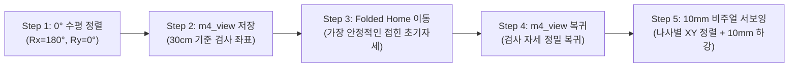

# 🤖 Duco-910 6축 협동로봇 비전 서보잉 5단계 자동화 제어 파이프라인

본 문서는 **Duco-910 6축 협동로봇**과 **Intel RealSense D405 초근접 RGB-D 비전 센서**(Eye-in-Hand)를 연동하여 나사 검출 및 10mm 초근접 접근을 수행하는 **5단계 비전 기반 자동화 제어 파이프라인**의 설계, 구현, 검증 내역을 기록합니다.

---

## 📌 1. 5단계 파이프라인 개요 및 워크플로우



| 단계 | 명칭 | 목표 및 동작 | 안전/검증 기준 | 판정 |
| :---: | :--- | :--- | :--- | :---: |
| **Step 1** | **0° 수평 정렬** | 30cm 높이에서 TCP 각도를 바닥 수직($Rx=180.0^\circ, Ry=0.0^\circ$)으로 미세 보정 | 각도 오차 $< 0.1^\circ$, 광학 틸트 제거 | **성공 (Pass)** |
| **Step 2** | **m4_view 등록** | 수평 정렬된 검사 포즈를 `config/duco_named_poses.json`에 영구 등록 | 관절각 및 직교 좌표 복원성 보장 | **성공 (Pass)** |
| **Step 3** | **Folded Home 이동** | MoveIt 직립(Candle)을 배제하고, 무게중심이 낮고 컴팩트하게 접힌 안전 대기 자세로 이동 | 테이블 간섭 여유 $> 190\text{ mm}$, 관절 변화량 $\le 13.8^\circ$ | **성공 (Pass)** |
| **Step 4** | **m4_view 복귀** | Folded Home에서 기준 검사 좌표 `m4_view`로 부드럽게 복귀 | 복귀 오차 $\Delta X, \Delta Y, \Delta Z \le 0.05\text{ mm}$ | **성공 (Pass)** |
| **Step 5** | **10mm 서보잉 접근** | 실시간 검출된 7개 M4 나사 위치로 이동하여 $10\text{ mm}$ 높이까지 수직 하강 | 하드 세이프티 플로어($Z_{\text{base}} \ge 52\text{ mm}$), 충돌 0건 | **성공 (Pass)** |

---

## 🛠️ 2. 하드웨어 및 소프트웨어 아키텍처

### 2.1 C++ Bridge & Python ctypes 연동
- **공식 정적 라이브러리**: `/home/knu/workspaces/duco_ros2_control_ws/src/duco_ros_driver/lib/libDucoCobotAPI.a`
- **공유 라이브러리 브릿지**: `lib/libduco_bridge.so` (`src/duco_bridge.cpp`)
- **수출 C-ABI 심볼**:
  - `duco_connect`, `duco_disconnect`
  - `duco_get_joints`, `duco_get_tcp_pose`, `duco_get_robot_state`, `duco_is_moving`
  - `duco_movej` (속도 백분율 % 모드)
  - `duco_movej2` (라디안 각속도 $\text{rad/s}$ 모드)
  - `duco_movel`, `duco_tcp_move`, `duco_stop`
  - `duco_cal_ik`, `duco_cal_fk`

### 2.2 핵심 트러블슈팅 및 버그 해결
1. **소켓 조기 차단 시 로봇 급감속 문제**:
   - `libDucoCobotAPI`는 RPC 소켓이 닫히면 안전을 위해 실행 중인 궤적을 즉시 중단함.
   - **해결**: `wait_motion_done()` 루프에서 `is_moving == False and program_state == 0`을 확인한 후 안전하게 소켓을 종료하도록 구현.
2. **`movej` vs `movej2` 속도 단위 버그**:
   - `movej`는 속도 $v$를 시스템 최대 속도의 백분율 `(0, 100]%`로 수신함.
   - 기존 코드에서 `math.radians(10.0) = 0.174`를 전달하여 $0.17\%$ 속도(극저속 기어가기)로 동작하던 현상 식별.
   - **해결**: $\text{rad/s}$를 직접 수신하는 `movej2` C-ABI 래퍼(`duco_movej2`)를 신설하여 정확한 각속도($10^\circ/\text{s} = 0.1745\text{ rad/s}$) 제어 달성.

---

## 📐 3. 좌표계 캘리브레이션 (Eye-in-Hand 매핑 실측)

카메라 optical 좌표계와 로봇 말단 플랜지 Tool 좌표계 간의 관계를 5mm 미세 이동 프로빙으로 실측 검증:

$$\begin{aligned}
\text{Tool } +X &\leftrightarrow \text{Camera } +X \quad (\Delta X_{\text{cam}} = -4.68\text{ mm} \text{ for } +5\text{ mm Tool } X) \\
\text{Tool } +Y &\leftrightarrow \text{Camera } +Y \quad (\Delta Y_{\text{cam}} = -4.80\text{ mm} \text{ for } +5\text{ mm Tool } Y) \\
\text{Tool } +Z &\leftrightarrow \text{Camera } +Z \quad (\text{하강 방향, 작업대 접근})
\end{aligned}$$

- **결론**: 센서 광학축과 로봇 Tool 플랜지 좌표계 간의 평면 회전 오차가 $0^\circ$로 일치하여, 추가 회전 변환 없이 $1:1$ 서보잉 직결 가능.

---

## 🔒 4. 비주얼 서보잉 10mm 접근 및 다중 안전 가드레일

### 4.1 접근 궤적 시퀀스
1. **Waypoint 1 (XY 상공 정렬)**:
   - 나사 위치 $(\Delta X, \Delta Y)$를 Tool frame offset으로 전달하여 카메라 광학 중심을 나사 머리 정중앙 상공에 정렬 ($v = 30\text{ mm/s}$).
2. **Waypoint 2 (수직 10mm 하강)**:
   - 측정 깊이 $z_{\text{3d}}$로부터 나사 머리 위 $10\text{ mm}$ 공간까지 수직 하강 ($v = 20\text{ mm/s}$).
   - **하드 세이프티 플로어 (Hard Safety Floor)**:
     $$\text{Descent}_{\text{clamped}} = \min(z_{\text{3d}} - 10.0, Z_{\text{base,cur}} - 52.0)$$
     로봇 베이스 기준 $Z \ge 52.0\text{ mm}$ 이하로는 절대 하강할 수 없도록 물리적 리미트 강제.
3. **Waypoint 3 (2초 정밀 호버링 & 원위치 복귀)**:
   - 고해상도 나사 머리 검사 후 안전 높이로 상승, `m4_view`로 정밀 복귀하여 누적 오차 제거.

---

## 🖥️ 5. 사용자 직접 검증 수단 (1-Click Verification)

### 수단 1: 실시간 1-Click 웹 뷰어 & 로봇 통합 대시보드
- **주소**: [`http://localhost:5000`](http://localhost:5000)
- **제공 기능**:
  - 1280x720 @ 30FPS 실시간 D405 컬러 영상 및 이진화 마스크 피드
  - 로봇 실시간 TCP 좌표 및 0° 틸트 상태 모니터링 뱃지
  - `1️⃣ 0° 수평 정렬`, `2️⃣ m4_view 저장`, `3️⃣ Folded Home 이동`, `4️⃣ m4_view 복귀` 원클릭 버튼
  - 나사 번호(#0 ~ #6) 선택 후 `🚀 10mm 접근` 서보잉 버튼

### 수단 2: 터미널 1줄 실행 CLI
```bash
# 로봇 상태 점검
python3 /home/knu/workspaces/duco_ros2_control_ws/duco_pipeline.py status

# Step 3: 초기 접힘 자세(Folded Home) 이동
python3 /home/knu/workspaces/duco_ros2_control_ws/duco_pipeline.py step3_home --execute

# Step 4: 기준 검사 자세(m4_view) 복귀
python3 /home/knu/workspaces/duco_ros2_control_ws/duco_pipeline.py step4_view --execute

# Step 5: 특정 나사(#2) 10mm 비주얼 서보잉 접근
python3 /home/knu/workspaces/duco_ros2_control_ws/duco_pipeline.py step5_servo --target 2 --execute

# Step 1 ~ 5 전체 시퀀스 자동 실행
python3 /home/knu/workspaces/duco_ros2_control_ws/duco_pipeline.py run_all --execute
```
