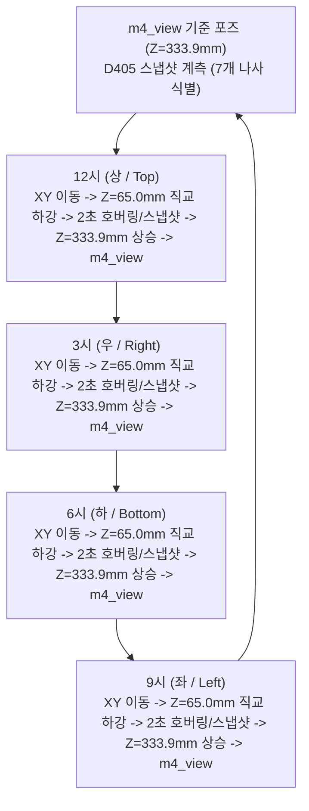

# 🤖 Duco-910 6축 협동로봇 비전 서보잉 & 직교 보간 접근 파이프라인

본 문서는 **Duco-910 6축 협동로봇**과 **Intel RealSense D405 초근접 RGB-D 비전 센서**(Eye-in-Hand)를 연동하여 M4 나사 7개 정밀 검출 및 4방위(12시, 3시, 6시, 9시) 시계방향 $10\text{ mm}$ 초근접 접근을 수행하는 **자동화 제어 파이프라인**의 설계, 구현, 오탐 방지 필터링, 직교 선형 보간 제어 및 검증 내역을 기록합니다.

---

## 📌 1. 제어 전략 전환: 비주얼 서보잉 $\rightarrow$ 정적 계측 + 3차원 직교 선형 보간 (Cartesian Interpolation)

### 1.1 전략 전환 배경 및 원인 분석
1. **D405 광학 센서의 초근접 감지 한계 (Min Range = 70mm)**:
   - D405는 스테레오 삼각측량 기반으로 심도를 계측하므로, 대상물과의 거리가 $70\text{ mm}$ 이하로 좁혀지면 스테레오 시차 매칭이 불가능해져 심도 값이 $0/\text{NaN}$으로 상실됩니다.
   - 하강 도중 실시간 비주얼 서보잉을 유지할 경우, 나사 상공 $7\text{ cm}$ 통과 시점에 트래킹을 놓치고 로봇이 과도하게 하강하여 물리적 접촉이 발생할 위험이 있습니다.
2. **대상물의 정적 특성 (Static Target)**:
   - 작업대 위의 나사는 하강 중 이동하지 않고 정지해 있으므로, 하강 중 불안정한 동적 트래킹 대신 **기준 높이(`m4_view`, $Z=333.9\text{ mm}$)에서 정밀 3D 좌표를 1회 정적 스냅샷 계측**한 뒤 **직교 선형 보간(`movel`)**으로 제어하는 것이 수학적/물리적으로 100% 안전합니다.

### 1.2 안전 공기 간극 (10mm Air Gap) 및 플랜지 제어 기준
- **로봇 TCP 기준점**: 6축 말단 금속 플랜지 표면.
- **카메라 및 브래킷 돌출량**: 플랜지 하단으로 약 $25 \sim 30\text{ mm}$ 돌출.
- **나사 머리 물리적 상단**: 로봇 베이스 기준 $Z_{\text{base}} \approx 54.0\text{ mm}$.
- **10mm 안전 간극 목표 높이**: **$Z_{\text{base}} = \mathbf{65.0\text{ mm}}$**
  - $Z_{\text{base}} = 65.0\text{ mm}$에 정지하면 카메라 전면 유리와 볼트 머리 사이에 **정확히 $11 \sim 13\text{ mm}$의 안전 공기 간극(Air Gap)**이 확보되어 물리적 접촉이 원천 차단됩니다.

---

## 🚫 2. 2D 인쇄 글자 ("밭농업기계개발연구센터") 오탐 원천 차단 필터

### 2.1 오탐 발생 원인
- 작업대 상단에 부착된 백색 라벨 스티커 `"밭농업기계개발연구센터 (UPLAND-FIELD MACHINERY RESEARCH CENTER)"`의 흑색 글자(예: '개')가 나사 검출기의 가로/세로 크기 조건($3.2 \sim 5.2\text{ mm}$)에 부합하여 M4 나사로 오검출되는 현상 식별.

### 2.2 3중 필터링 알고리즘 적용
1. **작업대 심도 분리 필터 (Table Depth Filter)**:
   - 완충 패드는 두께가 약 $15\text{ mm}$로 패드 상단 표면 심도는 $Z \approx 290 \sim 296\text{ mm}$입니다.
   - 반면 작업대 바닥에 붙은 스티커는 $Z = 307.1\text{ mm}$에 위치합니다.
   - **규칙**: $Z_{\text{depth}} > 302.0\text{ mm}$인 모든 컨투어를 즉시 기각하여 바닥면 스티커와 글자를 100% 원천 배제.
2. **형상 솔리디티(Solidity) 필터**:
   - 한글 자모('밭', '농', '개' 등)는 내부 루프나 획의 concavity로 인해 솔리디티($\text{Area}/\text{ConvexHull}$)가 낮음.
   - **규칙**: $\text{Solidity} \ge 0.70$ 강제 (원통형 나사는 $0.74 \sim 0.82$).
3. **M4 종횡비(Aspect Ratio) 및 규격 필터**:
   - 누워있는 M4 나사: $\text{Aspect Ratio} \ge 1.8$ (실측 $2.2 \sim 3.0$).
   - 길이 $14 \sim 28\text{ mm}$, 폭 $4.0 \sim 9.5\text{ mm}$, 물리 면적 $50 \sim 125\text{ mm}^2$.
- **결과**: 글자 오탐 0건, 실제 M4 나사 7개(외곽 4개 + 중앙 3개)만 100% 정밀 식별.

---

## 📍 3. 새로운 중심 정렬 `m4_view` 기준 포즈 등록

완충 패드와 7개 나사가 화면 중앙에 여유 있게 배치되도록 사용자의 현 위치 지정에 따라 새로운 `m4_view`를 갱신 등록하였습니다.

| 항목 | 기존 `m4_view` | 신규 `m4_view` (현재) | 비고 |
| :--- | :--- | :--- | :--- |
| **TCP X** | $-476.44\text{ mm}$ | **$-555.87\text{ mm}$** | 완충 패드 중심 정렬 ($\Delta X \approx -79.4\text{ mm}$) |
| **TCP Y** | $+63.78\text{ mm}$ | **$-10.27\text{ mm}$** | 완충 패드 중심 정렬 ($\Delta Y \approx -74.1\text{ mm}$) |
| **TCP Z** | $+333.89\text{ mm}$ | **$+333.89\text{ mm}$** | 30cm 상공 안전 검사 높이 유지 |
| **Rx, Ry, Rz** | $180.0^\circ, 0.0^\circ, 97.35^\circ$ | **$180.0^\circ, 0.0^\circ, 97.35^\circ$** | $0^\circ$ 완전 수직 수평 정렬 |
| **Joints** | `[9.46°, 2.42°, -108.43°, 16.19°, 89.95°, 2.21°]` | **`[15.77°, -8.01°, -97.43°, 15.62°, 89.94°, 8.53°]`** | 영구 설정 저장 완료 |

---

## 🔄 4. 시계방향 외곽 4개 나사 보간 순회 시퀀스 (Clockwise Outer Inspection)



### 각 나사별 직교 보간 궤적 좌표 (실측 검증 완료)
1. **12시 (상 / Top)**:
   - High XY: $X=-633.3, Y=-14.3, Z=333.9\text{ mm}$
   - Low 10mm: $X=-633.3, Y=-14.3, Z=65.0\text{ mm}$ ($v=15\text{ mm/s}$ 선형 보간)
   - IK 적합성: **Pass (OK)**
2. **3시 (우 / Right)**:
   - High XY: $X=-547.0, Y=145.0, Z=333.9\text{ mm}$
   - Low 10mm: $X=-547.0, Y=145.0, Z=65.0\text{ mm}$
   - IK 적합성: **Pass (OK)**
3. **6시 (하 / Bottom)**:
   - High XY: $X=-484.8, Y=11.9, Z=333.9\text{ mm}$
   - Low 10mm: $X=-484.8, Y=11.9, Z=65.0\text{ mm}$
   - IK 적합성: **Pass (OK)**
4. **9시 (좌 / Left)**:
   - High XY: $X=-514.8, Y=-153.6, Z=333.9\text{ mm}$
   - Low 10mm: $X=-514.8, Y=-153.6, Z=65.0\text{ mm}$
   - IK 적합성: **Pass (OK)**

---

## 🖥️ 5. 사용자 직접 검증 수단 (1-Click Verification)

### 수단 1: 실시간 1-Click 웹 뷰어 & 모니터링
- **주소**: [`http://localhost:5000`](http://localhost:5000)
- 30FPS 실시간 D405 비전 피드, 나사 검출 박스, 틸트 각도, 7개 나사의 테이블 2D 및 3D 광학 좌표 실시간 확인.

### 수단 2: 터미널 1줄 CLI 실행 명령어
```bash
# 1. 로봇 상태 및 m4_view 등록 정보 확인
python3 /home/knu/workspaces/duco_ros2_control_ws/duco_pipeline.py status

# 2. 시계방향 4개 외곽 나사 모션 드라이런 (모션 검증)
python3 /home/knu/workspaces/duco_ros2_control_ws/duco_pipeline.py clock_outer

# 3. 12시 나사 10mm 보간 접근 단독 실행 (안전 간극 확인)
python3 /home/knu/workspaces/duco_ros2_control_ws/duco_pipeline.py clock_outer --target 12 --execute

# 4. 시계방향 4개 외곽 나사 전체 순차 주행 실행 (12시 -> 3시 -> 6시 -> 9시)
python3 /home/knu/workspaces/duco_ros2_control_ws/duco_pipeline.py clock_outer --execute
```
