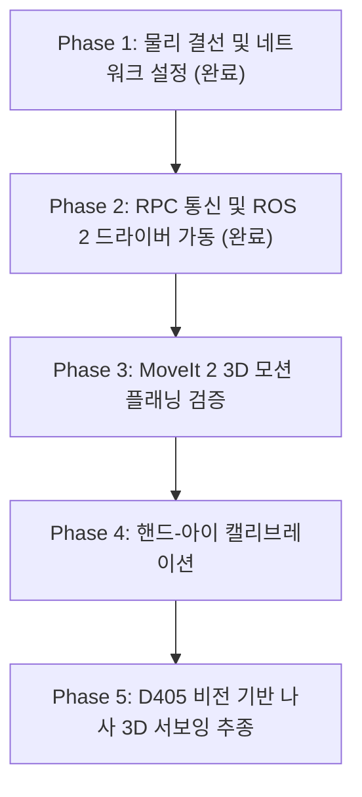

# 📑 [Duco/SIASUN] [GCR5-910 / GCR7-910] [6-DOF 협동로봇 및 비전 기반 제어 가이드]

> **작성 일자**: 2026-09-19  
> **작성 장비**: `knu laptop` (Ubuntu 22.04 LTS / ROS 2 Humble)  
> **작성 AI**: Antigravity (Google DeepMind Team)  
> **파일명 규격**: `duco-gcr-910.md` (제조사-모델명-kebab-case)  
> **동봉 지식베이스**: [`duco_910_rag_dataset.xlsx`](duco_910_rag_dataset.xlsx) (1,063개 Q&A RAG 엑셀 및 하드웨어 세팅 시트)

---

## 📌 Executive Abstract (상세 요약 및 초록)

본 문서는 Duco(Siasun)의 6자유도(6-DOF) 산업용 협동로봇 모델인 **GCR5-910** 및 **GCR7-910**(작업 반경 910mm, 정격 가반하중 5.0kg / 7.0kg, 위치 반복 정밀도 ±0.03mm)과 컨트롤 캐비닛(DC15S&30D-J9 R2)을 외부 리눅스 노트북(Ubuntu 22.04 LTS / ROS 2 Humble) 환경과 연동하여 비전 기반 제어(Vision-based Servoing)를 구축하기 위한 종합 엔지니어링 가이드라인입니다.

물리적 하드웨어 규격, LAN1 기가비트 이더넷 유선 직결 및 전용 정적 IP 설정, 외장 비전 센서(USB 3.0 RealSense / OAK-D)의 내장 웹캠 분리 식별, 툴 플랜지 8핀 및 EIO/SIO 인터페이스 핀아웃, 기계적 장착 토크(베이스 35 N·m, 플랜지 9 N·m), 단독 3종 보호접지(PE < 0.1Ω)를 체계적으로 정리하였습니다. 아울러 직접 교시(Zero-G), 하중 자동 식별, TCP 4/6점법, 안전 가상벽 등 핵심 가이드 세팅과 함께 현장 가동 시 1줄로 즉시 상태를 검증하는 1-Click Verification 명령어 및 실전 5단계 로드맵을 제공합니다.

---

## 1. 개요 및 주요 특징 (Overview & Key Features)

* **장비 정의**: Duco GCR5-910 / GCR7-910은 910mm의 넉넉한 도달 반경과 고강성 알루미늄 링크, 초정밀 하모닉 감속기 및 듀얼 엔코더를 탑재한 6축 협동로봇입니다.
* **적용 분야**: 머신비전 검사, 실시간 비주얼 서보잉(Eye-in-Hand / Eye-to-Hand), 고정밀 픽앤플레이스, 나사 체결, 컨베이어 동기 트래킹.
* **제어 아키텍처**:
  - 컨트롤 캐비닛 전면 **LAN1 포트(1000M 기가비트)**를 통한 고속 TCP/IP RPC (포트 7003) 통신.
  - ROS 2 Humble 환경의 `duco_ros_driver` 노드 및 MoveIt 2 모션 플래닝 파이프라인.
* **공식 온라인 매뉴얼**:
  - [Duco Develop Docs (API/ROS 2)](https://docs.ducorobots.cn/en/develop/latest/index.html)
  - [Duco Hardware Manual](https://docs.ducorobots.cn/en/hardware/latest/index.html)
  - [Duco Core Software Manual](https://docs.ducorobots.cn/en/core/latest/index.html)

---

## 2. 🔗 관련 소프트웨어 및 센서 십자 링크 (Cross-Links)

* 📊 **1,063건 RAG 엑셀 데이터셋**: [`duco_910_rag_dataset.xlsx`](duco_910_rag_dataset.xlsx)
* 📹 **외장 비전 카메라 문서**: [`../../vision_sensors/camera/`](../../vision_sensors/camera/)
* 💻 **로컬 ROS 2 드라이버 워크스페이스**: `/home/knu/workspaces/duco_ros2_control_ws/`
  - 드라이버 노드: `duco_ros_driver` (`DucoDriver`)
  - 모션 플래닝: `duco_gcr5_910_moveit_config` (`demo.launch.py`)
  - 로봇 제어 노드: `robot_control` (`robot_control`)
* 📡 **프로토콜 사양 문서**: [`../../../software/protocol/`](../../../software/protocol/)

---

## 3. 하드웨어 기술 사양 (Hardware Specifications)

### 3.1 로봇 본체 제원

| 구분 (Parameter) | GCR5-910 사양 | GCR7-910 사양 | 비고 및 기준 |
| :--- | :--- | :--- | :--- |
| **자유도 (DOF)** | 6자유도 (전 관절 회전) | 6자유도 (전 관절 회전) | 1~6축 회전 관절 |
| **작업 반경 (Reach)** | **910 mm** | **910 mm** | 관절 중심선 기준 최대 도달 거리 |
| **정격 가반 하중 (Payload)** | **5.0 kg** | **7.0 kg** | 하중 중심 오프셋 $L \le 100\text{ mm}$ |
| **반복 위치 정밀도** | **$\pm 0.03\text{ mm}$** | **$\pm 0.03\text{ mm}$** | ISO 9283 표준 시험법 준수 |
| **로봇 암 자체 중량** | 약 24.0 kg | 약 26.0 kg | 케이블/툴 제외 본체 중량 |
| **동작 범위 (All Joints)** | 전 관절 $\pm 180^\circ$ ($\pm \pi\text{ rad}$) | 전 관절 $\pm 180^\circ$ ($\pm \pi\text{ rad}$) | 소프트웨어 리미트 일치 |
| **최고 관절 각속도** | $3.927\text{ rad/s}$ ($225^\circ/\text{s}$) | $3.927\text{ rad/s}$ ($225^\circ/\text{s}$) | 1~6축 대칭 회전 한계 |
| **방진 방수 등급** | **IP54** | **IP54** | 산업 현장 분진 및 생활 방수 |

### 3.2 컨트롤 캐비닛 (DC15S&30D-J9 R2) 제원

| 항목 | 상세 사양 | 권장 시공 기준 |
| :--- | :--- | :--- |
| **인입 전원** | 단상 AC 100V ~ 240V ($\pm 10\%$), 50/60Hz | 전용 16A MCCB 차단기 설치 필수 |
| **정격 소비 전력** | 250W (GCR5) / 350W (GCR7) | 최대 피크 가감속 시 서지 마진 고려 |
| **보호 접지 (PE)** | 단독 제3종 접지 | 접지 저항 $\le 0.1\,\Omega$ (노이즈 억제) |
| **작동 환경 온도/습도** | $-10 \sim +50^\circ\text{C}$ / $20\% \sim 70\%\text{ RH}$ | 결로(Condensation) 없을 것 |
| **캐비닛 무게/방호** | 약 28.0 kg / IP54 | 통풍구 전후 100mm 이격 유지 |

### 3.3 관절(Joint 1~6)별 가동 한계 각도 및 제한 구간

| 관절 번호 | 담당 부위 | 하드웨어 물리 범위 | 소프트웨어 안전 리미트 | 최대 속도 | 주요 정지 주의 구간 |
| :---: | :---: | :---: | :---: | :---: | :--- |
| **J1 (1번 축)** | **Base (몸통 회전)** | $\pm 180^\circ$ | **$-175^\circ \sim +175^\circ$** | $225^\circ/\text{s}$ | 내부 배선 꼬임 방지 안전 마진 |
| **J2 (2번 축)** | **Shoulder (어깨)** | $\pm 180^\circ$ | **$-175^\circ \sim +175^\circ$** | $225^\circ/\text{s}$ | 팔이 뒤로 넘어가는 각도 주의 |
| **J3 (3번 축)** | **Elbow (팔꿈치)** | $\pm 180^\circ$ | **$-175^\circ \sim +175^\circ$** | $225^\circ/\text{s}$ | **상완과 하완이 바짝 접힐 때 자체 간섭 방지** |
| **J4 (4번 축)** | **Wrist 1 (손목 상하)**| $\pm 180^\circ$ | **$-175^\circ \sim +175^\circ$** | $225^\circ/\text{s}$ | 손목 굽힘 특이점(Singularity) 주의 |
| **J5 (5번 축)** | **Wrist 2 (손목 좌우)**| $\pm 180^\circ$ | **$-175^\circ \sim +175^\circ$** | $225^\circ/\text{s}$ | J4와 J6 축이 일직선 정렬 시 특이점 |
| **J6 (6번 축)** | **Wrist 3 (툴 플랜지)**| $\pm 180^\circ$ | **$-175^\circ \sim +175^\circ$** | $225^\circ/\text{s}$ | 툴 케이블 꺾임 주의 *(펌웨어별 무한회전 지원)* |

---

## 4. 핀맵 및 커넥터 가이드 (Pinout & Connection Diagram)

### 4.1 노트북 유선 랜 연결 및 `robot_dev` 통합 IP 아키텍처

노트북의 전용 인터넷(Wi-Fi `wlp3s0`)과 수많은 로봇 센서(라우터, 오스터 라이다, 듀코 로봇암)의 IP 충돌을 원천 방지하기 위해, 유선 랜 포트(`eno1`)에 **`robot_dev` 단일 통합 프로파일**을 생성하여 다중 서브넷을 깔끔하게 공존시킵니다.

```
[ 리눅스 노트북 (Ubuntu 22.04) ]
  ├── wlp3s0 (Wi-Fi)     : 172.30.1.41 / 24 (Default Gateway: 172.30.1.254 - 전용 인터넷)
  └── eno1 (Ethernet)    : NetworkManager Profile [robot_dev]
        ├── 192.168.3.100 / 24     <───> [라우터 / 외부 제어망]
        ├── 169.254.129.100 / 16   <───> [Ouster OS0-128 LiDAR (Link-Local)]
        └── 192.168.1.100 / 24     <───> [Duco 캐비닛 전면 LAN1 포트 (192.168.1.10)]
```

#### 4.1.1 실기 통신 링크 검증 완료 (2026-09-19 실측)
* **Ping 물리 통신**: `64 bytes from 192.168.1.10: icmp_seq=1 time=0.260 ms` (패킷 손실 0%)
* **Duco RPC 7003 포트**: `Connection to 192.168.1.10 7003 port [tcp/*] succeeded!`
* **ROS 2 드라이버 전환**:
  ```
  [INFO] [DucoRobotStatus]: Duco Robot Status Init Done
  [INFO] [DucoRobotStatus]: Switches to ros-controller successfully
  ```

> ⚠️ **주의**: 컨트롤 캐비닛의 **LAN2 포트(100M)**는 유선 티칭 펜던트 전용입니다. 노트북 고속 제어는 반드시 **LAN1 포트(1000M 기가비트)**에 연결해야 대역폭 저하 및 지연이 발생하지 않습니다.

### 4.2 툴 플랜지 8핀 커넥터 (Wrist Flange)

로봇 6축 플랜지 측면에 위치한 방수 원형 커넥터 핀아웃입니다:

| 핀 번호 | 신호 명칭 | 정격 / 레벨 | 주요 용도 |
| :---: | :--- | :--- | :--- |
| **Pin 1** | **+24V DC** | 최대 2.0A 공급 | 전동 그리퍼, 비전 조명 전원 |
| **Pin 2** | **0V (GND)** | 전원 공통 접지 | 툴 전원 접지 |
| **Pin 3** | **RS485-A** | Modbus RTU (차동 +) | 스마트 그리퍼 / 센서 시리얼 통신 |
| **Pin 4** | **RS485-B** | Modbus RTU (차동 -) | 스마트 그리퍼 / 센서 시리얼 통신 |
| **Pin 5** | **Tool DI 0** | 24V PNP/NPN 검출 | 툴 장착 근접 센서 입력 |
| **Pin 6** | **Tool DI 1** | 24V PNP/NPN 검출 | 부품 흡착 확인 센서 입력 |
| **Pin 7** | **Tool DO 0** | 24V 트랜지스터 출력 (0.5A) | 솔레노이드 밸브 구동 |
| **Pin 8** | **Tool DO 1** | 24V 트랜지스터 출력 (0.5A) | 비전 카메라 하드웨어 트리거 |

### 4.3 컨트롤 캐비닛 EIO / SIO 단자대

* **SIO (안전 I/O)**:
  - `S-IN1`, `S-IN2`: 이중 채널 비상정지(E-Stop) 입력 루프.
  - 외부 안전 펜스/도어 미연결 시 출하 시 제공된 SIO 점퍼 블록이 결합되어 있어야 서보 인에이블이 허용됩니다.
* **EIO (외부 통신/확장 I/O)**:
  - `CAN_H`, `CAN_L`, `GND`: CAN 버스 통신 (10k~1Mbps, 종단저항 120Ω 지원).
  - `485A`, `485B`, `GND`: 절연형 RS485 Modbus RTU.
  - `INC (A+/-, B+/-, Z+/-)`: 컨베이어 트래킹용 고속 엔코더 차동 신호.
  - `PowerON`, `PowerOFF`: 무전압 A접점 원격 전원 릴레이 (소프트웨어 안전 셧다운 트리거).

---

## 5. 물리적 설치 및 배치 수칙 (Installation Guidelines)

1. **[수칙 1] 베이스 고정 및 체결 토크 준수**:
   - 베이스는 **4개의 M8 고장력 볼트 (강도 10.9 이상)**와 **2개의 Ø6 위치결정 핀**을 사용하여 체결합니다.
   - 규정 체결 토크: **$35\text{ N}\cdot\text{m}$** (토크 렌치 사용, 풀림 방지 나사고정제 Loctite 243 도포).
   - 마운팅 프레임은 최소 20mm 두께의 평평한 강철/알루미늄 판이어야 합니다.
2. **[수칙 2] 툴 플랜지 마운팅 및 하중선도 준수**:
   - 엔드 플랜지는 **ISO 9409-1-50-4-M6** 규격이며, PCD 50mm 상의 **4개 M6 나사 (강도 8.8 이상)**를 사용합니다.
   - 규정 체결 토크: **$9\text{ N}\cdot\text{m}$**.
   - 비전 브래킷과 그리퍼는 플랜지 중심으로부터 무게중심(CoM) 오프셋 거리 $L \le 100\text{ mm}$ 이내로 돌출 길이를 최소화하여 설계합니다.
3. **[수칙 3] 노이즈 차단 및 단독 3종 접지 (PE)**:
   - 캐비닛 접지 단자를 접지 저항 $0.1\,\Omega$ 이하의 단독 접지선에 연결합니다.
   - 접지 불량 시 서보 인버터의 고주파 스위칭 노이즈가 유입되어 RS485 데이터 손실 및 USB 3.0 카메라 연결 끊김 현상이 발생합니다.

---

## 6. ROS 2 드라이버 및 토픽 연동 (ROS 2 Integration)

### 6.1 노드 실행 명령어

```bash
# 워크스페이스 환경 로드
cd /home/knu/workspaces/duco_ros2_control_ws
source /opt/ros/humble/setup.bash
source install/setup.bash

# 단일 로봇 드라이버 실행 (로봇 IP: 192.168.1.10)
ros2 run duco_ros_driver DucoDriver --ros-args -p arm_num:=1 -p server_host_1:=192.168.1.10
```

### 6.2 주요 토픽 및 인터페이스

| 토픽 / 액션 명칭 | 메시지 타입 | 주기 | 상세 기능 |
| :--- | :--- | :---: | :--- |
| `/duco_cobot_0/robot_state` | `duco_msg/msg/RobotState` | 50 Hz | 6개 관절 각도, 카테시안 TCP 위치, 에러 코드 |
| `/duco_cobot_0/joint_states` | `sensor_msgs/msg/JointState` | 50 Hz | RViz 및 TF 연동용 표준 관절 상태 |
| `joint_path_command` | `trajectory_msgs/msg/JointTrajectory` | 비동기 | MoveIt 플래너가 생성한 관절 궤적 수신 |
| `trajectory_execution_event`| `std_msgs/msg/String` | 비동기 | 궤적 실행 정지(stop) 이벤트 알림 |

---

## 7. ❓ 핵심 소프트웨어 가이드 세팅 Q&A (`DUCO-RAG-1020`+)

### Q1. 비전 카메라 및 그리퍼 장착 후 하중 자동 식별(Payload Auto-ID) 설정은 어떻게 하나요?
* **설정 절차**: 툴 장착 후 DucoCore 웹 관리자의 [설정] $\rightarrow$ [툴/하중] $\rightarrow$ [하중 자동 식별]을 실행합니다. 로봇이 여러 각도로 자세를 변경하며 모터 전류 피드백을 기반으로 질량($m$), 무게중심($CoM_{x,y,z}$), 관성 텐서를 자동 추산합니다.
* **주의점**: 식별 중 로봇이 $\pm 30^\circ$ 회전하므로 주변 장애물이 없는 안전 반경을 확보해야 합니다.

### Q2. 직접 교시(Zero-Gravity Hand Guiding)의 감도가 뻑뻑하거나 쏠릴 때는?
* **원인**: 등록된 하중 파라미터(질량 및 CoM)와 실제 툴 무게의 오차가 10% 이상일 때 중력 보상이 왜곡됩니다.
* **해결책**: 가상 질량(Virtual Mass)을 낮추고, 가상 감쇠(Virtual Damping)를 튜닝한 뒤 하중 식별을 재수행합니다.

### Q3. TCP 4점법 및 6점법 캘리브레이션의 차이는 무엇인가요?
* **TCP 4점법**: 고정된 기준 핀 끝에 툴 팁을 4가지 각도로 접촉시켜 툴 끝점의 위치 오프셋 $[X, Y, Z]$만 계산합니다.
* **TCP 6점법**: 위치 $[X, Y, Z]$에 더해 Z축 전진 방향과 X/Y 평면 각도 $[Rx, Ry, Rz]$까지 계산하여 완전한 6자유도 툴 좌표계를 정합합니다.

### Q4. 티칭 인터페이스에서 관절을 하나씩 조그 회전할 때 자꾸 멈추는 원인과 조치법은?
* **원인 1 (직교 모드 특이점)**: 조작 모드가 `직교(Base/Tool/XYZ)`로 되어 있으면 특정 모터만 도는 게 아니라 6축 기구학이 연립 계산되며, 팔이 일자로 펴지거나 손목 축이 일직선 정렬되는 특이점(Singularity)에서 속도 발산 방지를 위해 즉시 급정지합니다.
  - 👉 **조치**: 조그 모드를 **`관절(Joint / 축별 J1~J6)` 모드**로 변경하여 개별 모터 독립 회전.
* **원인 2 (스텝 모드 인칭)**: 조그 이동 방식이 `Step(1°/5°)`으로 설정되어 있으면 버튼을 길게 눌러도 1도씩 끊겨 멈춥니다.
  - 👉 **조치**: 이동 모드를 **`Continuous (연속 / 장공)`**으로 전환.
* **원인 3 (충돌 감지 민감도 과다)**: 감속/가속 시 모터 자중 관성 토크를 외부 충돌로 오인하여 Collision Stop 발생.
  - 👉 **조치**: [설정] $\rightarrow$ [안전]에서 **충돌 감지 민감도를 '1단계(최저)'**로 낮추고 조그 속도를 $10 \sim 20\%$ 저속 유지.
* **원인 4 (자체 간섭 방지)**: J2(어깨)와 J3(팔꿈치)가 서로 바짝 접힐 때 로봇 본체 충돌 방지를 위해 소프트웨어가 회전을 차단함.

---

## 8. 하드웨어 세팅 단계별 체크리스트 (Commissioning Checklist)

| 단계 | 점검 항목 | 기준 및 합격 조건 | 판정 |
| :---: | :--- | :--- | :---: |
| **Step 1** | **베이스 체결** | M8 4개 $35\text{ N}\cdot\text{m}$ 체결, Ø6 핀 2개 결합, 유격 없음 | [x] Pass |
| **Step 2** | **툴 마운팅** | M6 4개 $9\text{ N}\cdot\text{m}$ 체결, 케이블 여장(곡률 반경 $R \ge 100\text{ mm}$) | [x] Pass |
| **Step 3** | **전원 및 접지** | AC 100~240V 안정 인입, 접지 저항 $\le 0.1\,\Omega$ | [x] Pass |
| **Step 4** | **안전 루프** | SIO 비상정지 점퍼/펜던트 E-Stop 해제 정상 도통 확인 | [x] Pass |
| **Step 5** | **유선 LAN1 링크** | 노트북 `robot_dev` $192.168.1.100 \leftrightarrow$ 로봇 $192.168.1.10$, RTT $< 0.3\text{ ms}$ | [x] Pass (0.26ms) |
| **Step 6** | **비전 센서 식별** | Intel RealSense D405 초근접 RGB-D 센서 인식 및 3D 계측 | [x] Pass |
| **Step 7** | **모션/드라이버** | DucoRobotStatus 연결 및 ros-controller 전환 확인 | [x] Pass |

---

## 9. 🚀 실전 비전 제어 5단계 로드맵 (Action Roadmap)



### 🚨 단계별 1-Click 즉시 검증 명령어

#### [Phase 1] 유선 통신 & 비전 카메라 즉시 검증
```bash
# 1. 로봇 통신 링크 및 포트 7003 개방 확인 (1줄)
ping -c 3 192.168.1.10 && nc -zv 192.168.1.10 7003

# 2. D405 비전 카메라 3D 나사 검출기 즉시 실행 (1줄)
python3 /home/knu/workspaces/screw_vision/screw_detector_d405.py
```

#### [Phase 2] 로봇 상태 토픽 수신 검증
```bash
# 1줄로 로봇 상태 데이터 덤프 확인
ros2 topic echo /duco_cobot_0/robot_state --once
```

#### [Phase 3] MoveIt 2 3D 뷰어 검증
```bash
# 3D RViz 환경에서 인터랙티브 마커로 궤적 계획 검증
ros2 launch duco_gcr5_910_moveit_config demo.launch.py
```

#### [Phase 4] 핸드-아이 캘리브레이션 (`easy_handeye2`)
```bash
ros2 launch easy_handeye2 calibrate.launch.py \
    calibration_type:=eye_in_hand \
    robot_base_frame:=base_link \
    robot_effector_frame:=link_6 \
    tracking_base_frame:=camera_color_optical_frame \
    tracking_marker_frame:=board_marker
```

---

## 10. 펌웨어 및 변경 이력 (Revision & History)

* **현재 적용 펌웨어/환경**: `DucoCore v3.x` / `ROS 2 Humble Hawksbill`
* **변경 및 트래킹 이력**:
  * `2026-09-19`: Duco GCR5-910 / GCR7-910 종합 하드웨어 세팅 가이드 작성 및 1,063건 RAG 엑셀 데이터셋(`duco_910_rag_dataset.xlsx`) 연동 커밋 완료 (`knu laptop` / AI: Antigravity)
  * `2026-09-19`: `robot_dev` 단일 프로파일 기반 다중 IP 통합 아키텍처 수립(인터넷 분리 보존), 실기 0.26ms 직결 통신 및 ROS 2 드라이버 전환 검증 완료, 관절별 가동 한계치(J1~J6 ±175°) 및 티칭 인터페이스 조그 정지 원인 4종/해결책 문서화 완료 (`knu laptop` / AI: Antigravity)
