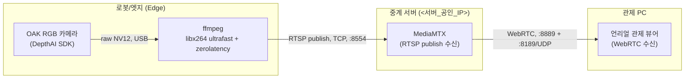

# 💻 로봇 RGB 카메라 실시간 영상 스트리밍 저지연 프로토콜 (RTSP/HLS/WebRTC 비교 및 WebRTC 채택)

> **작성 일자**: 2026-09-29
> **작성 장비**: `knu laptop` (KNU 노트북 PC / Linux)
> **작성 AI**: Claude (Anthropic) — Claude Code
> **파일명 규격**: `robot-camera-webrtc-streaming.md`

---

## 📌 Executive Abstract (상세 요약 및 초록)

주행체(포크레인 등)에 탑재된 OAK RGB 카메라 영상을 노트북(ffmpeg 인코딩) → 중계서버(MediaMTX) → 언리얼 관제 뷰어로 실시간 전송하는 파이프라인에서 **약 2초의 체감 지연**이 발생한 문제를 구간별로 실측 진단하고, **RTSP/HLS/WebRTC** 세 가지 전송 프로토콜을 정량 비교하여 **WebRTC를 관제용 영상 스트리밍의 기본 프로토콜로 채택**한 기록입니다. 진단 과정에서 중계서버의 MediaMTX가 1년 7개월간 미갱신 상태였고 WebRTC 코덱 협상 버그가 있었음을 발견, 최신 버전으로 업그레이드해 해결했습니다.

상세 실측 데이터와 트러블슈팅 전체 스토리라인은 아래 십자 링크의 `synology-server-roadmap` 레포 문서에 기록되어 있으며, 이 문서는 ROS2/센서 프로젝트 관점에서 **결론과 채택 근거**를 정리한 레퍼런스입니다.

---

## 1. 개요 및 파이프라인 (Overview & Pipeline)

* **목적**: 원격조종/관제용 카메라 영상을 사람이 실시간으로 조종 판단에 쓸 수 있는 수준(수십~백여 ms대)의 지연으로 전송.
* **전체 시스템 아키텍처 흐름도 (Mermaid)**:



---

## 2. 🔗 관련 문서 십자 링크 (Cross-Links)

* 🗺️ **상세 실측 진단 전체 기록 (구간별 지연, 서버 버그 발견/수정 과정)**: [`synology-server-roadmap/video_streaming_latency_investigation.md`](https://github.com/Gorani-ros2/synology-server-roadmap/blob/main/video_streaming_latency_investigation.md)
* 🖥️ **중계서버 인프라 전반**: [`synology-server-roadmap/README.md`](https://github.com/Gorani-ros2/synology-server-roadmap/blob/main/README.md) Chapter 5

---

## 3. 필수 환경 및 패키지 의존성 (Prerequisites & Dependencies)

* **카메라**: OAK RGB (Luxonis DepthAI SDK)
* **인코딩**: ffmpeg (libx264, `-preset ultrafast -tune zerolatency`)
* **중계서버**: MediaMTX **v1.21.1 이상** (v1.11.3 이하는 WebRTC 코덱 협상 버그 있음, 아래 6절 참고)
* **방화벽**: `8554/tcp`(RTSP), `8889/tcp`(WebRTC 시그널링), `8189/udp`(WebRTC ICE/미디어) 개방 필요

---

## 4. 소스코드 및 구동 가이드 (Source Code & Execution)

### 🚀 1줄 실행 명령어 (엣지에서 서버로 송출)
```bash
python3 depthai_rtsp_stream.py
# 내부적으로 아래 ffmpeg 커맨드로 RTSP publish
# ffmpeg -f rawvideo -pix_fmt nv12 -s 640x360 -r 10 -i pipe:0 \
#   -pix_fmt yuv420p -c:v libx264 -preset ultrafast -tune zerolatency \
#   -g 10 -keyint_min 10 -f rtsp -rtsp_transport tcp \
#   rtsp://<서버IP>:8554/robot_cam
```

### ⚙️ 관제 뷰어(WebRTC) 접속
* URL: `http://<서버IP>:8889/<경로명>` (예: `robot_cam`)
* 언리얼에서는 WebRTC 수신 플러그인을 통해 동일 경로에 연결 (플러그인 확정 사항은 별도 문서화 예정)

---

## 5. 프로토콜 비교 실측 결과 (Protocol Benchmark)

| 프로토콜 | 지연 | 채택 여부 |
| :--- | :--- | :--- |
| HLS (`:8888`) | **3.35초** | ❌ 세그먼트 기반 구조상 실시간 조종용 부적합, 배제 |
| RTSP (`:8554`) | **82ms** | 🟡 범용 테스트/백업용으로 유지 |
| **WebRTC (`:8889`)** | **가장 낮음** (정성적으로 RTSP보다 우위 확인) | ✅ **기본 채택** |

카메라 캡처 자체 지연(~26ms)과 노트북↔서버 네트워크 RTT(~10ms)는 무시할 수준으로, 병목은 **코덱/네트워크가 아니라 전송 프로토콜과 재생 클라이언트의 버퍼링 방식**이었습니다. (H.264→H.265 코덱 전환도 검토했으나, 이미 인코딩 지연은 최소화된 상태이고 오히려 소프트웨어 인코딩 시간이 늘어날 위험만 있어 기각.)

---

## 6. ❓ 개발/테스트 Q&A 및 트러블슈팅 (Q&A & Troubleshooting)

### Q1. WebRTC로 브라우저(Chrome) 접속 시 연결 자체가 거부됨
* **증상**: `A BUNDLE group contains a codec collision between {payload_type: 96, audio/PCMU} and {payload_type: 96, video/VP8}` 에러로 SDP 협상 실패.
* **원인**: 중계서버의 MediaMTX가 **v1.11.3**(2025-02 빌드)으로 1년 7개월간 미갱신. 해당 버전에 WebRTC 오디오/비디오 payload type이 충돌하는 버그가 있었음(`bluenviron/mediamtx#4394`, 이후 릴리즈에서 수정됨).
* **해결책**: MediaMTX를 **v1.21.1**로 업그레이드 (기존 바이너리는 백업 후 교체, 설정 파일은 그대로 유지 — 일부 파라미터명 deprecated 경고만 발생하고 정상 동작). 업그레이드 후 동일 브라우저로 재접속 시 정상 재생 확인.

### Q2. 낮은 프레임레이트(10fps)에서 재생 클라이언트 체감 지연이 유독 큼
* **증상**: 서버까지의 실측 지연은 ~220ms인데, ffplay 연속 재생 시 체감 지연은 ~0.5초로 더 큼.
* **원인**: 재생 클라이언트가 **프레임 개수 단위**로 내부 버퍼를 유지하는데, 10fps에서는 프레임 1장이 100ms라 버퍼 몇 장만 쌓여도 수백 ms 지연으로 증폭됨.
* **해결책**: fps를 **30으로 상향**(GOP도 `-g 10`→`-g 30`으로 비례 조정)하자 동일 측정 방식 기준 지연이 ~220ms → ~83ms로 감소. CPU/대역폭 여유도 충분히 확인됨(`ffmpeg speed=1.0x` 유지).

---

## 7. 발열 및 안전 관리 수칙 (Safety & Thermal Management)

* 30fps 전환 시에도 ffmpeg 인코딩 `speed`가 1.0x 밑으로 떨어지지 않는지 지속 모니터링 필요 (떨어지면 지연이 시간에 따라 누적되는 훨씬 나쁜 문제로 전환됨).
