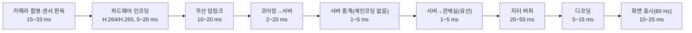

# 📑 원격 텔레오퍼레이션 영상·제어 실시간성 (Remote Teleoperation Video & Control Latency)

> **작성 일자**: 2026-09-29  
> **작성 장비**: `knu desktop` (AI: Claude Code)  
> **파일명 규격**: `teleoperation-video-control-latency.md`

- 구분 표기: **[실측]** 직접 테스트·측정, **[공식]** 1차 공식 자료(논문·제조사 문서·보도자료), **[추정]** 일반 공학 지식·추론(검증 필요)

> **관련 구체 사례**: 이 문서는 일반화된 조사·설계 패턴을 다룬다. 실제 카메라(OAK RGB) →
> ffmpeg → MediaMTX → 언리얼 관제 뷰어 파이프라인에서 §2.2의 원인들이 실제로 어떻게
> 나타났는지(RTSP 82ms/HLS 3.35초/WebRTC 최저 실측치, MediaMTX 구버전 WebRTC 코덱 충돌
> 버그 발견·수정 과정)는 [`robot-camera-webrtc-streaming.md`](robot-camera-webrtc-streaming.md)와
> [`synology-server-roadmap/video_streaming_latency_investigation.md`](https://github.com/Gorani-ros2/synology-server-roadmap/blob/main/video_streaming_latency_investigation.md)(별도 레포)
> 참고.

---

## 📌 Executive Abstract

본 문서는 카메라 → 인코딩 → 네트워크 → 서버 → 관제 PC로 이어지는 **원격 영상 확인 파이프라인**과,
관제 PC → 서버 → 로봇으로 이어지는 **원격 제어 명령 파이프라인**의 실시간성(지연)을 다룬다.
영상은 RTSP/HLS 계열과 WebRTC/RTP 계열의 버퍼링 구조 차이가 지연의 핵심 변수이고, 제어는
MQTT처럼 널리 쓰이는 pub/sub 프로토콜이 **실시간성을 사양으로 보장하지 않는다**는 점과 그
꼬리 지연(tail latency)을 로봇 안전 설계로 흡수하는 방법을 다룬다. 무선 WAN(LTE 등) 구간에서
NAT를 통과하며 로봇을 원격 제어하는 구성안 비교, VPN(WireGuard/OpenVPN)이 영상·제어 실시간성에
미치는 영향, 원격 건설기계 실증 사례와 ETH Zurich HEAP 논문의 100 ms 영상 지연 재현성 검토까지
포함한다.

---

## 1. 영상 지연 예산 분해 (Glass-to-Glass Latency Budget)

* **목적**: 카메라 촬영 순간부터 관제 화면에 표시되는 순간까지("glass-to-glass") 지연이 어느
  구간에서 발생하는지 분해해, 병목 구간을 실측 없이도 1차로 추정한다.



| 구간 | 일반적 소요 시간 | 비고 **[추정: 일반적 범위]** |
|---|---|---|
| 카메라 촬영·센서 판독 | 15~33 ms | 30~60 fps 기준 1프레임 간격 |
| 하드웨어 인코딩 (H.264/H.265) | 5~20 ms | 저지연 모드, B-frame 미사용 |
| 무선 업링크 (5G 예시) | 10~20 ms | LTE는 더 큼 |
| 코어망 → 서버 | 2~20 ms | 광케이블 전파 지연 약 5 µs/km |
| 서버 중계 (재인코딩 없음) | 1~5 ms | 단순 패킷 릴레이 전제 |
| 서버 → 관제실 (유선) | 1~5 ms | |
| 지터 버퍼 | 20~50 ms | 조정 가능 |
| 디코딩 | 5~15 ms | |
| 화면 표시 | 10~25 ms | |
| **합계** | **약 70~190 ms** | |

**핵심 관찰**: 네트워크 전파 지연보다 **카메라·인코딩·버퍼·디스플레이** 구간의 합이 더 큰
비중을 차지하는 경우가 흔하다. "영상이 느리다"는 증상을 네트워크 문제로 단정하기 전에, 이
전체 분해표를 기준으로 구간별 병목 분리 테스트(§4)부터 먼저 한다.

**주의**: "체감 조작 지연"은 영상 지연만이 아니다. 유압/모터 등 액추에이터의 물리적 응답
지연이 수백 ms 단위로 영상 지연보다 클 수 있다(§6 HEAP 사례 참고). 조작감을 평가할 때는
영상 지연·명령 전달 지연·액추에이터 응답 지연 세 가지를 분리해서 본다.

---

## 2. RTSP/HLS 계열 vs WebRTC/RTP 계열

### 2.1 구조적 차이

| 구분 | RTSP (일반 설정) | HLS/DASH | WebRTC/RTP |
|---|---|---|---|
| 전송 단위 | 프레임 단위, TCP가 흔함 | 2~6초 세그먼트 파일 | 프레임을 패킷 단위로 즉시 전송(UDP) |
| 서버 역할 | 중계 또는 재인코딩 | 세그먼트 저장·배포(CDN 친화) | SFU가 그대로 중계(재인코딩 없음) |
| 기본 버퍼 | 클라이언트별로 상이(아래 표) | 수 초 | 적응형 지터 버퍼(수십 ms) |
| 손실 대응 | TCP 재전송(RTSP-TCP) 또는 없음(RTSP-UDP) | HTTP 재요청 | NACK/FEC |
| 전형적 지연 | 설정에 따라 수백 ms~수 초 | 수 초~수십 초 | 수십~수백 ms |
| 용도 | IP 카메라 감시, 저지연 스트리밍(튜닝 시) | 방송·VOD(대규모 동시접속) | 화상통화·원격조종(실시간 양방향) |

### 2.2 "RTSP인데 2초씩 밀린다" — 흔한 원인

같은 LAN 안에서 카메라→서버→클라이언트 전송 자체는 수 ms 수준이므로, 수 초 단위 지연은
**거의 항상 네트워크가 아니라 소프트웨어 버퍼링·인코딩 설정 문제**다.

| 구간 | 흔한 지연 원인 | 대표 설정 |
|---|---|---|
| 송신측 인코딩 | x264 lookahead, B-frame, 긴 GOP | `-tune zerolatency -preset ultrafast -bf 0 -g 30` |
| 서버 | 재인코딩(트랜스코딩), HLS 변환 | 패킷 중계만 하도록 설정 |
| RTSP 수신 클라이언트 | 클라이언트 기본 버퍼 | GStreamer `rtspsrc` latency 기본 **2000 ms**, VLC `network-caching` 기본 **1000 ms** |
| 렌더링 엔진(Unreal/Unity 등) 수신부 | 기본 Media Framework 재생 버퍼 | 저지연 수신 플러그인/모듈 검토 |
| 전송 방식 | RTSP over TCP 재전송 대기 | LAN에서는 UDP 우선 |

**프레임레이트가 지연에 미치는 영향(실측 확인됨)**: 인코더 lookahead·디코더 재정렬·수신
버퍼는 대개 "프레임 개수" 단위로 동작하므로, fps가 낮으면 같은 버퍼 크기라도 시간상 지연이
비례해 커진다. 예: 10프레임 버퍼는 10 fps에서 1초, 30 fps에서는 0.33초. **fps를 올리는 것만
으로도 체감 지연이 크게 줄 수 있다** — 10 fps → 30 fps 전환과 RTSP → WebRTC 전환을 함께
적용해 수 초 지연이 크게 개선된 사례가 실측으로 확인됨 **[실측]** (다만 두 변경을 동시에
적용하면 각각의 기여도는 분리되지 않으므로, 기여도 분리가 필요하면 한 번에 하나씩 바꿔 재측정).

**WebRTC 전환 시 주의**: 망 혼잡 시 해상도·fps를 자동으로 낮추는 적응형 비트레이트가 기본
동작이므로, 무선 환경에서 화질 저하로 나타날 수 있다 — 저지연과 화질 안정성은 트레이드오프.

### 2.3 병목 구간 분리 절차

```bash
# 1) 송신 PC → 수신 PC 직접 수신 (서버·렌더링엔진 제외) — 인코딩 자체 지연 확인
ffplay -fflags nobuffer -flags low_delay -framedrop -rtsp_transport udp rtsp://<송신PC IP>/...

# 2) 서버 경유 → 수신 PC(ffplay) — 서버 중계 지연 추가 확인
# 3) 서버 경유 → 렌더링엔진(Unreal/Unity 등) — 최종 수신부 지연 추가 확인
```
1번이 느리면 인코딩 문제, 2번에서 추가로 느려지면 서버 문제, 3번만 느리면 수신 렌더링
엔진의 버퍼 설정 문제로 좁혀진다.

### 2.4 glass-to-glass 실측 방법
카메라 앞에 밀리초 단위로 갱신되는 디지털시계(또는 스마트폰 스톱워치)를 두고, 원본 시계
화면과 관제 화면을 **한 장의 사진으로 동시에** 촬영한다 — 두 값의 차이가 전체 파이프라인
지연이다. 소프트웨어 타임스탬프 로그보다 각 구간의 클록 동기화 오차에 영향받지 않는
장점이 있다.

---

## 3. 관련 하드웨어·소프트웨어 십자 링크 (Cross-Links)

* 🌐 **4G LTE 라우터(VPN·NAT 통과 구성 예시)**: [`Teltonika RUT241 라우터`](../../hardware/support_sensors/router/teltonika-rut241.md)
* 📹 **산업용 PoE/RTSP 카메라 폼팩터**: [`산업용 PoE/RTSP 카메라 비교`](../../hardware/vision_sensors/camera/streaming_camera/industrial-poe-rtsp-camera-form-factors.md)
* 🛰️ **MQTT 기반 텔레메트리 서버 적재 파이프라인(참고 아키텍처)**: [`RTK Telemetry MQTT-DB Bridge`](rtk-mqtt-db-bridge.md)

---

## 4. MQTT의 구조적 비실시간성과 로봇 제어 채널 설계

### 4.1 결론
MQTT는 **실시간성을 사양으로 보장하지 않는다** — 프로토콜에 전달 시한(deadline) 개념이
없고, QoS 0/1/2는 "몇 번 전달되는가"만 규정할 뿐 "언제까지 전달되는가"는 규정하지 않는다.
같은 LAN에서 평균 지연은 수 ms로 매우 낮지만, 문제는 평균이 아니라 **꼬리 지연(tail
latency)**이다.

### 4.2 지연이 튀는 원인

| 원인 | 내용 |
|---|---|
| TCP 기반 전송 | 패킷 손실 시 재전송 완료까지 **뒤에 오는 메시지 전부가 대기**(head-of-line blocking). Linux 최소 RTO(재전송 타임아웃) 200 ms |
| 브로커 경유 | 발행자 → 브로커 → 구독자, 최소 2홉 |
| QoS 1/2 | 확인 응답 왕복이 추가됨(QoS 2는 4-way 핸드셰이크) |
| Nagle 알고리즘 | `TCP_NODELAY` 미설정 시 작은 패킷이 모아져 전송되며 지연 발생 |
| 끊김 감지 지연 | keepalive 간격 × 1.5가 지나야 연결 끊김을 인지할 수 있음 |

### 4.3 로봇 제어 관점의 위험
통신이 일시적으로 막혔다 풀리면, **막혀 있던 동안 쌓인 과거 명령이 한꺼번에 순서대로
전달**될 수 있다 — 로봇이 이미 낡은(stale) 명령을 연속으로 실행하는 위험한 상태가 된다.
연속 조작 명령(조이스틱류)처럼 "최신 값만 의미 있는" 트래픽에 신뢰성 있는 큐잉 프로토콜을
그대로 쓰면 이 문제가 구조적으로 발생한다.

### 4.4 보완 설계 패턴
- **연속 조작 명령은 QoS 0**(또는 애초에 신뢰성 없는 UDP 계열 채널로 분리)로 최신성을 우선하고, 재전송으로 오래된 명령이 쌓이지 않게 한다.
- 모든 명령에 **타임스탬프 + 시퀀스 번호**를 싣고, 수신측(로봇)에서 오래되었거나 역순으로 도착한 명령은 폐기한다.
- 로봇 측에 **워치독**을 둔다(정해진 시간(N ms) 안에 새 명령이 없으면 정지). 비상정지는 통신 채널의 정상 수신 여부에 의존하지 않도록 별도 경로로 구현한다.
- **단발 명령**(목표 지점 이동 등 결과가 중요한 것)은 신뢰성 있는 경로(QoS 1 + 고유 goal ID)를 쓰고, goal ID로 중복 실행을 차단한다(QoS 1은 "최소 1회 전달"이라 중복 수신이 원리적으로 가능함).
- 소켓에 `TCP_NODELAY`를 설정해 Nagle 알고리즘에 의한 불필요한 지연을 없앤다.

### 4.5 ROS2와 결합할 때의 아키텍처 패턴
MQTT ↔ ROS2 브리지 노드를 둘 때, 연속 명령과 단발 명령을 다른 경로로 분리하는 것이
실전에서 유효했다:
- 연속 명령: 브리지 노드가 오래된·역순 메시지를 걸러낸 뒤 `cmd_vel` 등으로 발행 → `twist_mux`(입력별 타임아웃, lock 토픽) 또는 `diff_drive_controller`의 `cmd_vel_timeout`으로 명령 끊김 시 자동 정지.
- 단발 명령: 브리지 노드가 MQTT 메시지를 `Nav2 NavigateToPose` 등 ROS2 액션으로 변환, goal ID로 액션의 피드백/결과/취소를 매핑.
- 상태·텔레메트리(현재 모드·배터리 등)는 MQTT의 **retained 메시지**로 발행해, 새로 접속하는 관제 클라이언트가 즉시 최신 상태를 받게 한다.

---

## 5. 무선 WAN에서의 NAT 통과와 VPN 실시간성 영향

### 5.1 무선 WAN(LTE 등)에서 새로 생기는 제약
- **통신사 NAT(CGNAT)**: 로봇에 공인 IP가 없어, 외부(관제 서버 등)에서 로봇으로 먼저 접속을
  시작할 수 없다. 로봇이 서버로 먼저 접속하는 프로토콜이거나, 별도의 NAT 통과 수단이 필요하다.
- 무선 구간의 패킷 손실·지터가 유선보다 크므로, TCP 기반 프로토콜(MQTT 등)의 재전송 지연이
  실제로 체감될 만큼 나타난다.
- 업링크 대역이 다운링크보다 좁게 설계된 경우가 많아, 로봇→서버 방향인 **영상 송신이 병목**이 되기 쉽다.

### 5.2 프로토콜별 NAT 통과 방식

| 방식 | NAT 통과 |
|---|---|
| MQTT | 가능 — 로봇(클라이언트)이 브로커로 먼저 접속하는 구조라 자연히 해결됨 |
| WebRTC | 가능 — ICE/STUN으로 대부분 해결, 대칭형 NAT 등 일부 환경은 TURN 중계 필요 |
| ROS2 DDS(기본, 미들웨어 무관) | 어려움 — 멀티캐스트 기반 노드 탐색이 NAT 너머로 전파되지 않음. Zenoh(`rmw_zenoh`) 브리지나 VPN으로 우회 |
| 자체 UDP 프로토콜 | NAT 통과 로직(홀 펀칭 등)을 직접 구현해야 함 |

### 5.3 VPN(원격 접속 구성) 도입 시 비교

| 구성 | 명령 전송 선택지 | TURN 서버 | 미확인 위험 |
|---|---|---|---|
| VPN 없음 | MQTT(로봇이 선접속), WebRTC(STUN/TURN) | 필요할 수 있음 | TURN 필요 여부 |
| 라우터(예: LTE 라우터)에서 VPN 종단 | MQTT, WebRTC, ROS2(Zenoh·DDS 유니캐스트), 자체 UDP까지 모두 가능(로봇 서브넷 전체가 가상망에 편입) | 불필요 | **라우터의 VPN 처리량이 영상 비트레이트를 제한할 가능성**(저전력 라우터는 CPU가 병목이 될 수 있음) |
| 로봇 PC에서 VPN 종단 | 라우터 VPN과 동일 | 불필요 | 로봇 PC 부하 소폭 증가 |

VPN을 어느 층에서 종단하든, **서버가 인터넷에서 접근 가능해야**(공인 IP 또는 포트 개방)
성립하는 전제는 동일하다.

### 5.4 VPN이 영상 실시간성에 미치는 영향

조건만 맞으면 VPN이 추가하는 지연은 수 ms 이하로 작다 **[추정]**. 다만 아래 조건에서는
실시간성이 크게 나빠질 수 있다:

1. **터널 처리량 < 영상 비트레이트** — 이 경우가 가장 흔하고 치명적이다. 대기열이 쌓이며
   수백 ms 이상 지연이 발생한다. 저전력 라우터에서 WireGuard/OpenVPN 처리량은 반드시 실측
   확인해야 하는 값.
2. **VPN 종단 서버 ≠ 영상 중계 서버** — 우회(hairpin) 경로로 인한 추가 지연.
3. **TCP 기반 VPN 사용** — TCP 위에 TCP(영상이 이미 TCP를 쓰는 경우)를 얹으면 재전송 대기가
   중첩되어 지연이 크게 늘 수 있다(“TCP-over-TCP meltdown”으로 알려진 현상). VPN은 가급적
   UDP 기반(WireGuard 기본값, OpenVPN은 UDP 모드 선택)으로 구성한다.
4. **MTU 초과로 인한 조각화** — WireGuard 기본 MTU는 1420이며, 캡슐화 오버헤드(IPv4 20 +
   UDP 8 + WireGuard 헤더 16 + 인증 태그 16 = 패킷당 약 60바이트, 1200바이트 패킷 기준 약
   5%)를 고려해 상위 계층 패킷 크기를 조정해야 조각화를 피할 수 있다.

### 5.5 OpenVPN 구성 시 주의
OpenVPN은 UDP/TCP 모두 지원하지만 **TCP 모드는 피한다**(위 §5.4-3 문제). 원격 라우터를
서버로 쓰려면 공인 IP가 필요하므로, 무선 WAN 환경에서는 보통 원격 라우터가 VPN
**클라이언트**, 중앙 서버 측이 VPN 서버 역할을 맡는 구성이 된다.

---

## 6. 실전 벤치마크 — 원격 건설기계·ETH HEAP 논문

### 6.1 원격 건설기계 실증 연표 **[공식]**

| 시기 | 주체 | 내용 |
|---|---|---|
| 1969 | 일본 | 수중 불도저 원격 굴착 — 일본 토목 최초 무인화 시공 |
| 1994~ | 일본(가지마·구마가이구미·니시마쓰 등) | 화산 복구 대규모 무인화 시공(무선조종) |
| 2018 | KDDI·오바야시·NEC | 5G + 4K 3D 모니터링 원격 건설기계 |
| 2018~2019 | 국내 중공업사·통신사 | 수백~수천 km 원격지 굴착기 조종 실증 |
| 2020 | 해외 중장비 제조사 | 1,700마일 원격 불도저 조종 |
| 2021~2023 | 일본 중공업사 | 5G 기반 복수 장비 전환 조종 → 원격제어 시스템 상용 판매 |

- 원격 건설기계를 먼저 시작한 곳은 일본이며, **제어 명령의 전송 프로토콜(TCP/UDP, 패킷
  구조)을 상세 공개한 업체는 찾지 못함** — 상용 사례 대부분이 영상 전송 기술(초저지연
  인코딩, 5G/MEC)만 공개하고 제어 채널 프로토콜은 비공개.

### 6.2 제어 명령 방식 3분류

| 방식 | 원리 |
|---|---|
| A. OEM 전자유압 직접 연동 | 장비 컨트롤러에 전자 신호를 직접 입력 |
| B. 무선 RC 신호 변환 | 원격 조종 신호를 기존 RC 장비 신호로 변환 |
| C. 레트로핏 로봇 | 운전석에 설치된 로봇이 레버·페달을 물리적으로 조작 |

가시권 조종기는 900 MHz~2.4 GHz 대역에서 400 m 안팎이 실측 한계로 보고된 사례가 있고,
비가시권은 무선망(5G/MEC) 성능이 허용하는 범위까지 확장된다. 통신 단절·조종기 이상 기울기
등에서 **모든 동작을 즉시 정지**시키는 안전 로직은 상용 시스템 공통 요소.

### 6.3 ETH Zurich HEAP 논문의 100 ms 영상 지연 검토 **[공식]**

- 논문: *HEAP - The Autonomous Walking Excavator*, ETH Zurich Robotic Systems Lab / Moog
  Industrial Group, arXiv 2106.05059.
- 5.4절에서 "4K 1대 + 2.5K 4대 카메라 동시 저지연 스트리밍으로 100 ms 달성"이라고만
  서술 — 카메라 모델, 코덱, 전송 프로토콜, 네트워크, 수신·디스플레이 구성, **측정 구간
  정의**가 전혀 없어 **논문만으로는 재현 불가능**한 수치다. 100 ms는 논문의 핵심 기여가
  아니라 적용 사례의 결과 보고 한 문장.
- 관련 제조사(XIMEA) 사례 문서가 별도로 공개한 실제 파이프라인은 더 구체적이다: NVIDIA
  Jetson TX2 + 스테레오 카메라, RAW 취득 → 블랙레벨 보정 → 화이트밸런스 → 디베이어 →
  감마보정 → YUV 변환 → H.264/H.265 인코딩 → RTSP 스트리밍. GPU ISP 처리 지연은 15 ms(2대
  동기)로 실측 보고되었고, glass-to-glass는 "네트워크에 따라 60 ms를 넘지 않을 것"이라는
  목표치 서술(실측 보고 아님). 해상도·fps는 1416×1416 @ 40 fps.
- **해석 시 주의**: 논문 수치(카메라 5대 구성)와 제조사 사례(스테레오 2대 구성)가 같은
  설치를 가리키는지 불명확 — 하나의 수치로 일반화하지 않는다. RTSP를 쓰고도 저지연을
  달성했다는 점은, "RTSP는 원래 느리다"는 통념보다 **수신 측 버퍼 설정이 핵심 변수**라는
  §2 결론을 뒷받침한다. 특수 장비가 아니라 상용 부품(보급형 Jetson TX2, 표준 코덱, RTSP)을
  저지연 방향으로 조합했을 뿐이며, 핵심은 RAW 취득 → GPU ISP → 하드웨어 인코딩 경로로
  **처리 지연을 확인 가능한 값(15 ms)으로 관리**한 것이다.

### 6.4 HEAP의 명령 경로와 팔 구동 방식별 응답 **[공식]**

- 경로: 원격 PC → 네트워크 → 캐빈 PC(현장 컴퓨터) → CAN 100 Hz → 밸브·액추에이터. 시간이
  중요한 통신은 공유 메모리, 덜 중요한 것은 ROS로 분리. **지연에 민감한 제어 루프는 현장
  컴퓨터에 두고, 원격에서는 상위 명령만 전송**하는 분담 구조가 핵심 시사점.
- 반자율 원격조종: 조종자는 팔(암) 작업만 담당하고, 차체 균형 제어는 현장 컨트롤러가 자동
  수행.

| 구동 방식 | 속도 제어 t90 | 힘 제어 t90 |
|---|---|---|
| 서보 밸브 | 35 ms | 40 ms |
| 파일럿 밸브 | 650~850 ms | 650 ms |
| 조이스틱 액추에이션 | 600 ms | 720 ms |

유압 액추에이터 자체의 물리적 응답이 수백 ms 단위인 경우가 흔해, 조작 체감 지연에서
영상·통신 지연보다 액추에이터 응답이 더 큰 비중을 차지할 수 있다 — 원격조종 시스템
설계 시 영상 지연만 최적화하고 액추에이터 응답 특성을 간과하지 않는다.

---

## 7. ❓ 자주 묻는 질문 (Q&A)

### Q1. 같은 LAN인데 RTSP 영상이 2초씩 밀립니다. 네트워크를 의심해야 할까요?
같은 LAN의 전파 지연은 수 ms 수준이라 거의 항상 아니다. §2.2의 표(인코더 GOP/lookahead,
서버 재인코딩, 클라이언트 기본 버퍼값)부터 순서대로 확인한다. 가장 흔한 원인은 GStreamer
`rtspsrc` 기본 latency 2000 ms, VLC `network-caching` 기본 1000 ms 같은 **수신 클라이언트의
기본 버퍼값**이다.

### Q2. WebRTC로 바꾸면 무조건 RTSP보다 빠른가?
프로토콜 자체보다 **버퍼 전략과 전송 방식(UDP vs TCP)**이 핵심이다. RTSP도 저지연 튜닝
(nobuffer, low_delay, UDP 전송, GOP 축소)을 하면 XIMEA 사례처럼 낮은 지연을 낼 수 있다.
다만 WebRTC는 실시간 통화용으로 설계되어 적응형 지터 버퍼·NACK/FEC가 기본 내장돼 있어,
별도 튜닝 없이도 저지연을 얻기 쉽다는 실전 이점이 있다. 대신 망 혼잡 시 자동으로 화질을
낮추는 트레이드오프가 있다.

### Q3. MQTT로 로봇 정지 명령을 보냈는데, 통신이 잠깐 끊겼다 복구되니 로봇이 낡은 명령을
연속 실행합니다. 왜 그런가요?
TCP 기반 pub/sub 프로토콜은 연결이 끊긴 동안 쌓인 메시지를 **순서대로 한꺼번에** 재전달
하는 것이 기본 동작이다(§4.3). 연속 조작 명령에는 신뢰성 있는 큐잉이 오히려 위험 요소가
된다 — 타임스탬프+시퀀스 번호로 오래된 명령을 로봇 측에서 폐기하고, 워치독으로 통신
자체가 끊기면 정지하도록 이중으로 설계한다(§4.4).

### Q4. LTE 라우터에 VPN을 켰더니 영상이 심하게 끊깁니다. VPN 자체의 암호화 오버헤드
때문인가요?
대부분 아니다. PC급 CPU에서 WireGuard/OpenVPN 암호화 연산 자체는 매우 가볍다. 실제로는
**저전력 라우터의 VPN 처리량이 영상 비트레이트보다 낮아 대기열이 쌓이는 경우**가 훨씬
흔한 원인이다(§5.4-1). `iperf3 -u -b <영상 비트레이트>`로 터널 처리량부터 실측하고,
부족하면 VPN 종단을 로봇 PC 쪽으로 옮기거나(§5.3) 더 높은 처리량의 라우터를 검토한다.

### Q5. ROS2 DDS를 LTE 같은 무선 WAN 너머로 그냥 쓰면 안 되나요?
DDS의 기본 노드 탐색(discovery)은 멀티캐스트에 의존하는데, 멀티캐스트는 NAT를 통과하지
못한다(§5.2). 같은 서브넷이 되도록 VPN으로 묶거나, `rmw_zenoh`처럼 유니캐스트 기반
브리지를 쓰는 우회가 필요하다 — 배포판별 지원 여부는 별도 확인.

---

## 참고 자료

- [HEAP - The Autonomous Walking Excavator (arXiv 2106.05059)](https://arxiv.org/abs/2106.05059)
- [XIMEA Case study: Remotely Operated Walking Excavator](https://www.ximea.com/en/corporate-news/excavator-remotely-operated-tele)
- [Teltonika Wiki – RUT241 VPN](https://wiki.teltonika-networks.com/view/RUT241_VPN)

---

## 변경 이력

- 2026-09-29: 최초 작성 — 영상 지연 예산 분해, RTSP/WebRTC 비교, MQTT 실시간성 한계와
  보완 설계 패턴, 무선 WAN NAT 통과·VPN 영향, 원격 건설기계·HEAP 논문 벤치마크 정리.
