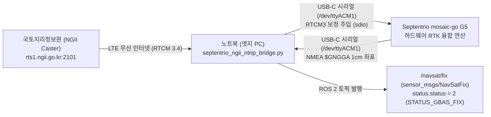

# 💻 Septentrio mosaic-go G5 NGII NTRIP RTK & ROS 2 NavSatFix 파이프라인

## 1. 개요 및 파이프라인 (Mermaid 흐름도)

본 모듈은 **Septentrio mosaic-go G5 평가키트**의 USB-C 인터페이스(`/dev/ttyACM1`)를 활용하여, **국토지리정보원(NGII) NTRIP 캐스터(`rts1.ngii.go.kr:2101`)**로부터 무선 LTE 인터넷(RUT241)을 거쳐 4대 위성군(GPS, GLONASS, BeiDou, Galileo) 보정데이터(RTCM3)를 수신기에 양방향 주입하고, 최종 1cm 초정밀 위치 토픽(`/navsat/fix`)을 발행하는 통합 ROS 2 드라이버 노드입니다.



---

## 2. 🔗 관련 하드웨어 장비 문서 십자 링크

* **RTK GNSS 수신기 하드웨어 레퍼런스**: [`hardware/support_sensors/gps_rtk/septentrio-mosaic-go-g5-p3h.md`](../../hardware/support_sensors/gps_rtk/septentrio-mosaic-go-g5-p3h.md)
* **LTE 무선 통신 라라우터 레퍼런스**: [`hardware/support_sensors/router/teltonika-rut241.md`](../../hardware/support_sensors/router/teltonika-rut241.md)
* **LiDAR 센서 융합 레퍼런스**: [`hardware/vision_sensors/lidar/ouster-os0-128.md`](../../hardware/vision_sensors/lidar/ouster-os0-128.md)

---

## 3. 필수 환경 및 패키지 의존성

* **운영체제**: Linux Ubuntu 22.04 LTS
* **ROS 2 버젼**: ROS 2 Humble Hawksbill (`rclpy`, `sensor_msgs`, `geometry_msgs`)
* **Python 라이브러리**: `python3-serial` (`pyserial`)
* **네트워크 프로필**: 유선 통합 개발 프로필 `robot_dev` (RUT241 무선 LTE 인터넷 연결 상태)

---

## 4. 소스코드 및 구동 가이드

### 4.1 소스코드 위치
* [`software/ros2_basics/septentrio_ngii_ntrip_bridge.py`](septentrio_ngii_ntrip_bridge.py)

### 4.2 1줄 실행 명령어 (Execution Command)

```bash
source /opt/ros/humble/setup.bash && python3 ~/workspaces/insta360/software/ros2_basics/septentrio_ngii_ntrip_bridge.py \
    --ros-args -p username:=<아이디> -p password:=<비밀번호>
```

> [!TIP]
> 마운트포인트 `VRS-RTCM34`는 코드 내 기본값으로 탑재되어 있지만, 계정 자격증명(아이디/비밀번호)은
> 보안상 코드에 하드코딩하지 않습니다. 위처럼 `--ros-args -p username:=... -p password:=...`로
> 매번 전달하거나, 커밋되지 않는 로컬 launch 파일/환경변수로 관리하십시오.

### 4.3 정상 출력 검증 예시 (Expected Topic Output)

새 터미널에서 `ros2 topic echo /navsat/fix` 구동 시 아래와 같이 `status.status: 2` 및 센티미터급 정밀 좌표가 출력됩니다:

```yaml
header:
  stamp:
    sec: 1787030810
    nanosec: 996921307
  frame_id: gnss
status:
  status: 2               # 2 = STATUS_GBAS_FIX (1cm 초정밀 RTK Fixed 고정)
  service: 15              # 15 = GPS + GLONASS + BeiDou + Galileo (4대 위성 풀 가동)
latitude: 36.117807555    # 1cm 정밀 위도
longitude: 128.631998658  # 1cm 정밀 경도
altitude: 136.9819        # 타원체 고도 (m)
position_covariance:
- 0.0001
- 0.0
- 0.0
- 0.0
- 0.0001
- 0.0
- 0.0
- 0.0
- 0.0004
position_covariance_type: 1
---
```

---

## 5. 발행 및 구독 토픽 정의 (Topic Specifications)

| 토픽명 | 메세지 타입 | 발행 주기 | 설명 |
| :--- | :--- | :--- | :--- |
| **`/navsat/fix`** | `sensor_msgs/msg/NavSatFix` | 1 Hz | 1cm 정밀 WGS84 위도, 경도, 고도 및 RTK 보정 상태 |
| **`/navsat/vel`** | `geometry_msgs/msg/TwistStamped` | 1 Hz | GNSS 지상 이동 속도 (m/s) |

---

## 6. ❓ 개발/테스트 Q&A 및 트러블슈팅

### Q1. 수신기 본체에 물리 RJ45 랜포트가 없는데 어떻게 인터넷으로 RTK 보정 데이터를 넣나요?
* mosaic-go G5 키트는 물리 랜포트가 없으므로 **USB-C 케이블 단 1줄로 양방향 통신**을 수행합니다.
* 본 파이썬 노드가 RUT241 LTE 인터넷을 타고 국토지리정보원에서 RTCM3 데이터를 내려받아 **USB 시리얼 포트(`/dev/ttyACM1`)로 수신기에 주입**하고, 연산된 결과 좌표를 동일한 포트로 읽어옵니다.

### Q2. 보정데이터를 주입하는데도 `status.status`가 `0` (단독 측위)에 머물렀던 원인 및 해결책은?
* **원인**: 수신기 내부 칩셋에 *"USB 시리얼 포트로 들어오는 RTCM3 데이터를 해독하라"*는 명령(`sdio`)이 전달되지 않아 수신기가 보정데이터를 무시했기 때문입니다.
* **해결책**: 노드 초기화 시 `sdio, USB1, auto, RTCMv3` 명령을 송신하도록 보완하여 **수신기 칩셋 해독 엔진을 활성화함으로써 `status.status: 2`로 실시간 승격**을 완성했습니다.

### Q3. 마운트포인트 `VRS-RTCM34`와 `VRS-RTCM32`의 차이점 및 호환성은?
* 국토지리정보원 캐스터(`rts1.ngii.go.kr:2101`)에서 제공하는 4대 위성(GPS, GLONASS, BeiDou, Galileo) 광역 VRS 보정의 공식 명칭이 `VRS-RTCM34`입니다.
* Septentrio mosaic-go G5 펌웨어는 RTCM 3.4 MSM 규격을 100% 하드웨어 디코딩하므로, 가장 우수한 고정 속도와 1cm 정밀도를 제공합니다.

---

## 7. 발열 및 안전 관리 수칙

* **USB 통신 과전류 방지**: USB-C 케이블 연결 시 노트북 및 수신기 핀 접촉 부위에 이물질이 들어가지 않도록 보호 커버를 착용하십시오.
* **시리얼 포트 점유 충돌 방지**: 동일한 시리얼 포트(`/dev/ttyACM1`)를 여러 노드가 중복 오픈하지 않도록 단일 드라이버 노드로 구동하십시오.
