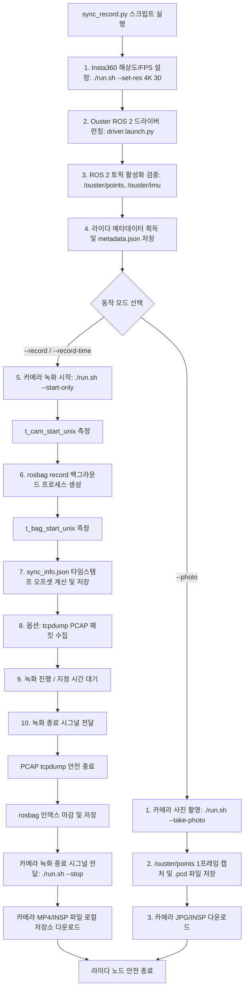

# 라이다 & Insta360 동시 제어 및 시간 동기화 (LiDAR & Camera Synchronized Controller)

> **작성 일자**: 2026-08-11  
> **작성 장비**: `knu laptop` (KNU 노트북 PC)  
> **작성 AI**: Antigravity (Google DeepMind Team)  
> **파일명 규격**: `lidar-insta360-sync-record.md`

---

## 📌 Executive Abstract (상세 요약 및 초록)
본 문서는 Ouster OS0-128 3D 라이다, Insta360 360도 카메라, Septentrio RTK 수신기 멀티 센서 융합 시스템의 동시 제어 아키텍처, 파이썬 동기화 녹화 스크립트(`sync_record.py`), ROS 2 오프셋 동기화 및 다중 센서 고온 발열 방지 수칙을 다룹니다.

---

## 1. 개요 및 정의

Ouster OS0-128 3D 라이다와 Insta360 360도 파노라마 카메라의 이종(Heterogeneous) 센서를 통합하여 **시분할/연속 동시 녹화**, **스틸 샷 동시 캡처**, **ROS 2 타임스탬프 동기화**, **원천 PCAP 수집** 및 **시스템 최대 온도 변화 대응 관리**를 수행하는 통합 동시 제어 기술입니다.


---

## 관련 하드웨어

- [Ouster OS0-128 3D 라이다](../../hardware/vision_sensors/lidar/ouster-os0-128.md)
- [Insta360 파노라마 카메라 (Camera SDK)](../../hardware/vision_sensors/camera/insta360-camera-sdk.md)
- [Septentrio mosaic-go G5 P3H RTK 수신기](../../hardware/support_sensors/gps_rtk/septentrio-mosaic-go-g5-p3h.md)


---

## 아키텍처 / 데이터 흐름



---

## 타임스탬프 시간 동기화 메커니즘 (Time Synchronization)

1. **라이다 타임스탬프**: Ouster 드라이버 설정 `timestamp_mode: "TIME_FROM_ROS_TIME"`에 따라 시스템 호스트 시간 기반 ROS 2 헤더 타임스탬프가 부여됩니다.
2. **카메라 타임스탬프 오프셋 산출**:
   - 카메라 녹화 명령 수신 직후 Unix timestamp(`t_cam_start_unix`)를 생성합니다.
   - rosbag 프로세스 런칭 직후 Unix timestamp(`t_bag_start_unix`)를 생성합니다.
   - **동기화 오프셋**: `cam_to_bag_offset_sec = t_bag_start_unix - t_cam_start_unix`
   - 이 데이터는 `sync_info.json`에 저장되어 이종 미디어 후처리 시 비디오 프레임과 점군(Point Cloud) 간의 정확한 시각을 매칭합니다.

```json
{
  "camera_fps": 30,
  "lidar_hz": 10,
  "points_topic": "/ouster/points",
  "camera_frame_period_ms": 33.33,
  "lidar_scan_period_ms": 100.0,
  "camera_frames_per_lidar_scan": 3.0,
  "t_cam_start_unix": 1723365000.123,
  "t_bag_start_unix": 1723365000.456,
  "cam_to_bag_offset_sec": 0.333
}
```

---

## 🌡️ 시스템 최대 온도 변화 및 써멀 통합 관리 (Max Temperature & Thermal Management)

동시 제어 시 하드웨어(LiDAR, Camera, Host PC) 전체의 **복합 열부하**를 사전에 관리해야 합니다.

### 1. 센서 및 호스트 단계별 과열 한계치

| 컴포넌트 | 과열 단계 / 현상 | 한계 온도 | 영향 및 시스템 반응 |
| :--- | :--- | :--- | :--- |
| **Ouster OS0-128 LiDAR** | **Shot Limiting (1단계)** | 약 60°C 부근 | 레이저 샷 부분 강제 OFF → 점군 듬성듬성 결측 (이빨 빠짐 현상) |
| | **Thermal Shutdown (2단계)** | 약 75°C~80°C | 레이저 100% 강제 차단 → `OVER_TEMP` 상태 및 데이터 수신 0% |
| **Insta360 Camera** | **Auto-Shutdown Protection** | 내부 DSP 70°C 이상 | 고해상도(8K) 인코딩 발열로 자동 녹화 중단 및 카메라 셧다운 |
| **Host PC (노트북)** | **CPU Thermal Throttling** | CPU 코어 85°C 이상 | CPU 성능 저하로 인한 커널 UDP Socket Buffer Overflow → **rosbag 결측 발생** |

### 2. 열 부하 진단 및 모니터링 명령어
- **LiDAR 온도 조회**: `curl -s http://<sensor_ip>/api/v1/sensor/telemetry | jq .internal_temperature_deg_c`
- **Host PC CPU 쓰로틀링 진단**: `sudo dmesg -T | grep -iE "thermal|throttle"`

### 3. 과열 방지 및 시스템 최적화 방안
- **포인트 클라우드 Hz Throttle**: `--lidar-hz 5` 옵션을 적용하여 `/ouster/points` 데이터를 5Hz로 리샘플링하여 Host PC의 커널 UDP 버퍼 처리 및 NVMe 쓰기 부하를 50% 절감.
- **카메라 해상도 최적화**: 8K 대신 **4K @ 30fps**를 사용하여 Insta360 인코딩 프로세서 발열을 제어.

---

## 사용 예시 및 실행 명령어

### 1. 지정 시간(예: 10초) 동안 동시 녹화
```bash
python3 sync_record.py.bak --record-time --duration 10 --res 4K --fps 30
```

### 2. 수동 종료(ENTER키 입력) 시까지 연속 동시 녹화
```bash
python3 sync_record.py.bak --record --res 4K --fps 30
```

### 3. 라이다 스로틀링(5Hz) 및 원천 PCAP 패킷 백업 포함 동시 녹화
```bash
python3 sync_record.py.bak --record-time --duration 20 --lidar-hz 5 --pcap
```

### 4. 1프레임 시분할 동시 스틸 샷 (Photo + PCD 캡처)
```bash
python3 sync_record.py --photo
```

### 5. 대용량(8K/장시간) 녹화 시 대역폭 방지 다운로드 스킵 모드
```bash
python3 sync_record.py --record --res 4K --fps 30 --no-download
```

---

## 6. ❓ 개발/테스트 Q&A 및 트러블슈팅

### Q1. Insta360 비디오 추출 중 `http_tunnel_client.cpp: write to socket` 메세지가 출력되다가 멈추고(Freeze) `Ctrl+C`도 먹히지 않습니다. 원인이 무엇인가요?

**근본 원인 (Root Causes)**:
1. **Insta360 SDK USB HTTP 터널 대역폭 한계 및 Socket Buffer Stall**:
   - 8K/5.7K 해상도 또는 10분 이상의 장시간 녹화 파일(1GB~10GB 이상)을 USB-C 연결을 통해 SDK HTTP 터널 바이너리(`insta360_control --download`)로 다운로드할 때 `http_tunnel_client.cpp` 내부 소켓 송수신 버퍼 오버플로우 및 USB Bulk Transfer 소켓 락이 발생합니다.
   - `total: 1056063752` bytes (~1.05 GB) 지점에서 카메라 SDK의 `write to socket` 소켓 버퍼가 가득 차 블로킹(Blocking I/O) 상태로 멈춥니다.
2. **`sync_record.py` 파이썬 스크립트의 SIGINT (`SIG_IGN`) 이관 현상**:
   - 기존 파이썬 스크립트의 `finally` 클린업 블록에서 `signal.signal(signal.SIGINT, signal.SIG_IGN)`이 실행되면, 하위 프로세스로 호출된 `./run.sh --download` (`insta360_control`) 프로세스가 `SIGINT` (Ctrl+C) 시그널 무시 상태를 상속받습니다.
   - 사용자가 터미널에서 `Ctrl+C`를 눌러도 C++ SDK 핸들러가 `[Signal] Interrupted by user (signal 2). Stopping process...` 로그만 출력할 뿐 소켓 read/write 시스템 콜 블로킹을 빠져나오지 못합니다.
3. **SDK 내부 300초(5분) 소켓 타임아웃 지연 (HttpTunnelService Timeout)**:
   - Insta360 C++ SDK(`http_tunnel_service.cpp`) 내부에 300초(5분) 무응답 소켓 타임아웃 타이머가 설정되어 있어, 소켓이 멈춘 시점(`10:41:05`)부터 정확히 5분 후(`10:46:05`)에 `[Download] Download failed!` 및 `HttpTunnelService:: begin close serveice` 로그를 출력하며 비로소 자동 종료됩니다. `SIG_IGN` 상태에서는 이 5분 동안 터미널이 강제 응답 대기 상태에 처합니다.

---

### Q2. 현재 터미널이 멈춰있을 때 긴급 조치 및 프로세스 강제 종료 명령어는 무엇인가요?

다른 터미널(새 창)을 열어 아래 명령어로 멈춰있는 `insta360_control` 및 `sync_record.py` 프로세스를 SIGKILL(`-9`) 시그널로 즉시 강제 종료합니다.

```bash
# 1. stuck된 insta360 다운로드 및 파이썬 컨트롤러 즉시 강제 종료
killall -9 insta360_control python3

# 2. 특정 PID 직접 강제 종료 (예: PID 17287)
kill -9 17287
```

---

### Q3. 대용량 8K/5.7K 비디오 파일을 안전하게 추출하는 권장 파이프라인은?

1. **`--no-download` 옵션 활용 (추천)**:
   - `python3 sync_record.py --record --res 4K --fps 30 --no-download` 명령어로 실행하면 rosbag 및 타임스탬프 동기화 파일(`sync_info.json`)만 로컬에 저장하고, 대용량 비디오 파일 자동 다운로드를 스킵합니다.
2. **SD 카드 직접 마운트 / USB 마스스토리지 전송**:
   - 카메라 SD 카드를 PC에 직접 연결하거나 USB 마스스토리지(Mass Storage) 모드로 파일(INSV/MP4)을 빠르게 복사합니다.
3. **USB 3.0 포트 및 직결 케이블 검증**:
   - USB 허브를 거치지 않고 PC 전면/후면 USB 3.0(파란색) 포트에 direct 연결되어 있는지 확인합니다.

---

### Q4. Insta360 카메라가 녹화 중간에 스스로 중지되는 현상을 실시간으로 진단 및 모니터링하는 방법은 무엇인가요?

**1. 수동 상태 진단 명령어 (`./run.sh --status`)**:
터미널에서 아래 명령어를 실행하면 카메라 접속 상태, 현재 동작 모드, 현재 녹화 진행 여부(`CaptureCurrentStatus`), 배터리/스토리지 잔량을 즉시 확인합니다.
```bash
./run.sh --status
```

**2. 녹화 중작 3대 원인과 방지책**:
- **카메라 내부 과열 셧다운 (Thermal Shutdown)**: 8K/5.7K 녹화 시 내부 DSP 과열로 10~15분 후 자동 정지 → **4K @ 30fps** 설정을 적용하여 발열 정지를 100% 방지합니다.
- **SD 카드 쓰기 버퍼 오버플로우**: V30 규격 미달 SD 카드 사용 시 인코딩 병목으로 자동 정지 → **U3 / V30 이상 SD 카드** 사용.
- **USB 연결 및 전원 불안정**: 외부 전원 공급 부족 시 자동 정지 → USB 3.0 직결 케이블 사용 및 카메라 배터리 완충 유지.
